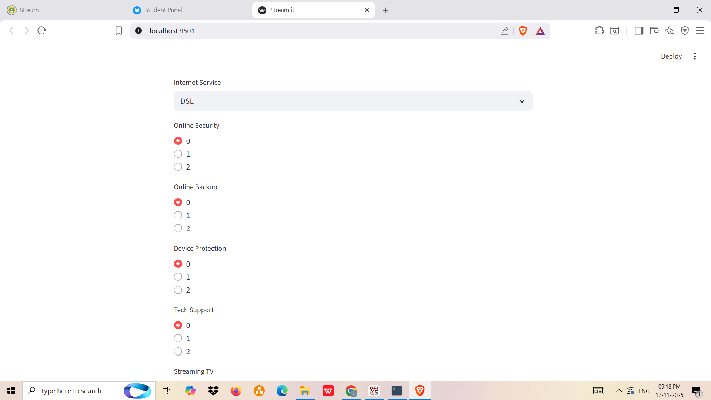
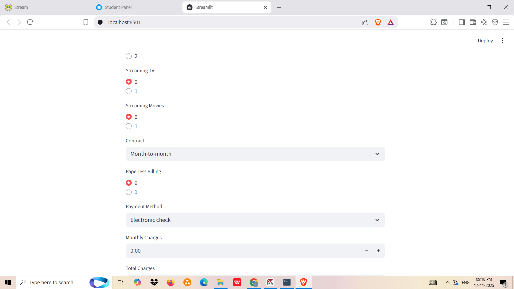
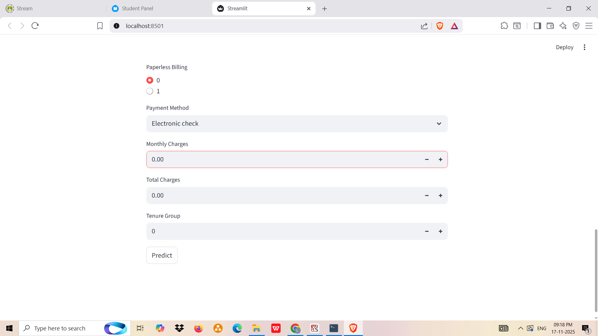

# 📡 Telco Customer Churn Prediction

This project is my take on solving the "Customer Churn" problem. I dug into customer data to figure out why people leave and built a Machine Learning model to predict who might leave next. To top it off, I wrapped it all up in a simple Streamlit web app so non-technical users can get predictions instantly.

# 🚀 What's This Project About?

Imagine you are a telecom manager. You have thousands of customers, but you don't know who is unhappy until they cancel. This tool changes that.

Analysis: We analyze demographic, account, and service data to find patterns.

Prediction: We use advanced algorithms (Gradient Boosting was the winner!) to calculate the likelihood of a customer leaving.

Action: The web interface allows you to input specific customer details and get a "Churn" or "Stay" prediction immediately.

# 📸 Screenshots

The following images are taken from the deployed Streamlit web application (app.py), demonstrating the input required and the prediction output.

## Streamlit UI

## Prediction Result

Note: The images above demonstrate the Streamlit interface where users select options like Contract type, Payment method, etc.

# 🧠 The Machine Learning Workflow

Here is the journey from raw data to a working app:

## 1. Exploratory Data Analysis (EDA)

* I started by cleaning the data (handling missing values in TotalCharges) and visualizing trends.

* Key Insight: Customers on Month-to-month contracts and those using Electronic check payments were significantly more likely to churn.

* Visuals: Created correlation heatmaps and distribution plots (KDE) to understand how monthly charges affect churn.

## 2. Data Preprocessing & Feature Engineering

* Binning: Grouped tenure into ranges (e.g., 1-12 months) to make patterns clearer.

* Encoding: Converted text categories (like "Yes/No", "Fiber optic") into numbers the computer understands.

* Balancing the Scale: The dataset had way more "loyal" customers than "churners" (imbalanced data). I fixed this using SMOTE (Synthetic Minority Over-sampling Technique) so the model wouldn't be biased.

## 3. Model Selection

I threw several algorithms at the problem to see what stuck:

* Logistic Regression

* Decision Trees

* Random Forest

* AdaBoost

* XGBoost

* Gradient Boosting Classifier (The Winner! 🏆)

After tuning hyperparameters (like learning rate and tree depth), the Gradient Boosting model achieved an accuracy of ~84%.

# 🛠️ Tech Stack

* Python: The core language.

* Pandas & NumPy: For crunching the numbers.

* Matplotlib & Seaborn: For making the data look good.

* Scikit-Learn: For the heavy lifting (training models).

* Imbalanced-learn: To handle the dataset imbalance.

* Streamlit: To build the frontend web application.

# 💻 How to Run This Locally

Want to try it out? Follow these steps:

## 1. Clone the repository:

git clone [https://github.com/your-username/customer-churn-project.git](https://github.com/your-username/customer-churn-project.git)
cd customer-churn-project

## 2. Install dependencies:
Make sure you have the required libraries installed.

pip install pandas numpy matplotlib seaborn scikit-learn imbalanced-learn streamlit joblib xgboost

## 3. Run the Streamlit App:
This command will launch the web interface in your default browser.

streamlit run app.py

## 4. (Optional) Re-train the Model:
If you want to see the analysis or retrain the model from scratch, open the Jupyter Notebook:

jupyter notebook Customer_Churn_Project.ipynb

# 📂 Project Structure

'''
Customer_Churn_Project/
│
├── Customer_Churn_Project.ipynb      # Jupyter Notebook: Model Building & Analysis
├── app.py                            # Streamlit Web App for Predictions
├── final_gb_classifier.pkl           # Saved Machine Learning Model
├── Telco-Customer-Churn.csv          # Dataset Used for Training
│
├── Output_1.png                      # Screenshot: Homepage UI
├── Output_2.png                      # Screenshot: Input Form
├── Output_3.png                      # Screenshot: More Inputs
├── Output_4.png                      # Screenshot: Prediction Process
├── Output_5.png                      # Screenshot: Final Prediction Output
│
└── README.md                         # Project Documentation

'''

# 🔮 Future Improvements

Deployment: Host the app on Streamlit Cloud so anyone can access it via a URL.

Model Interpretation: Add SHAP plots to the app to show why the model made a specific prediction (e.g., "Churn predicted because Monthly Charges > $100").

Live Data Connection: Connect the app to a live database instead of manual input.

# 📬 Contact

Kummara Lahari
📧 lahari11kummara@gmail.com