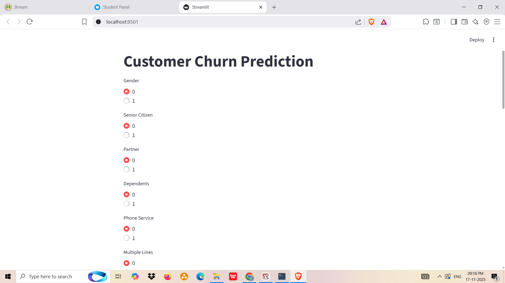
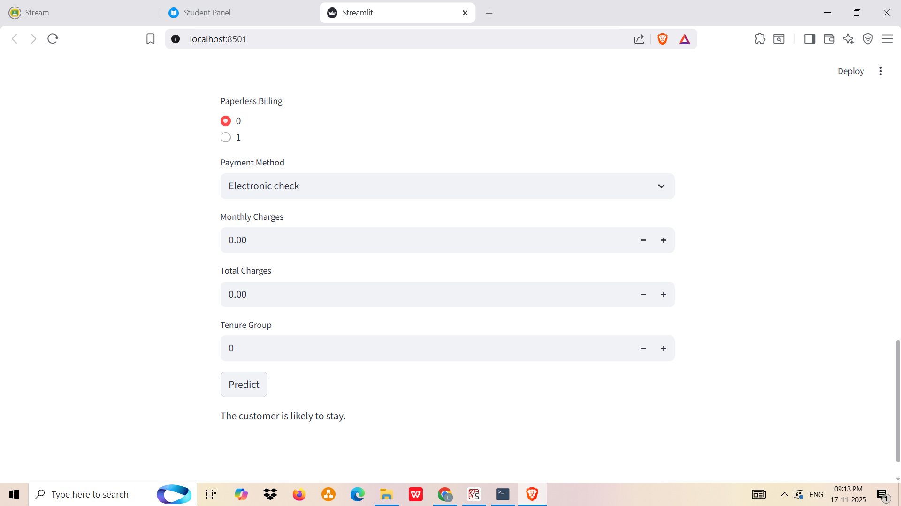

# 📊 Customer Churn Prediction

Welcome! 👋
This project is all about predicting whether a customer will **stay with a telecom company** or **leave (churn)**.
I’ve built a complete machine learning workflow and also created a Streamlit web app so anyone can test the model easily.

This README explains everything in a clean, friendly way so you can understand the project without getting stuck in heavy technical terms.

---

# 🌟 What This Project Does

Companies lose money when customers leave their service.
With this project, we try to **predict churn before it happens** so businesses can take action.

You enter a customer’s information (like contract type, monthly charges, internet service, etc.), and the app will tell you:

* 🟢 **The customer is likely to stay**
  or
* 🔴 **The customer is likely to churn**

---

# 🧠 What’s Inside the Project

This project has two main parts:

---

## 1️⃣ Machine Learning Notebook

(File: **Customer_Churn_Project.ipynb**)

This is where all the ML magic happens.

### Inside the notebook:

* Cleaned and prepared the dataset
* Explored the data with graphs and trends
* Converted text categories into numbers
* Trained different models
* Selected the best one: **Gradient Boosting Classifier**
* Checked how accurate the model is
* Saved the final model as a `.pkl` file so we can use it later

---

## 2️⃣ Streamlit App

(File: **app.py**)

This is the user-friendly part of the project.

### In the app you can:

* Select customer details using buttons and dropdowns
* See the prediction instantly
* Understand whether the customer will leave or stay

The app loads the saved `.pkl` model and gives results in real time.

---

# 🗂 Project Structure

```
Customer_Churn_Project/
│
├── Customer_Churn_Project.ipynb  # Model building and analysis
├── app.py                        # Streamlit app for predictions
├── final_gb_classifier.pkl       # Saved machine learning model
├── Telco-Customer-Churn.csv      # Telecom Dataset
├── Output_1.png                  
├── Output_2.png
├── Output_3.png
├── Output_4.png
├── Output_5.png
└── README.md                     # Project Explanation

```

---

# ⚙️ Technologies Used

* Python
* Pandas
* NumPy
* Scikit-learn
* Streamlit
* Joblib
* Matplotlib 
* Seaborn

Simple, common tools — nothing too complex.

---

# ▶️ How to Run This Project

## Step 1: Install the required libraries

Create a `requirements.txt` and install using:

```
pip install -r requirements.txt
```

## Step 2: Run the Streamlit app

Use the command:

```
streamlit run app.py
```

The app will open in your browser automatically.
Super simple!

---

# 🟩 Output & Results

Here’s what you’ll see after running the project:

---

## 📌 **Notebook Output**

The model gives you:

* Accuracy score
* Confusion matrix
* Precision, recall, F1-score
* Visual charts from EDA

These help understand how well the model performs.

---

## 📌 **Streamlit App Output**

### 🟢 Example Output (Customer stays)

```
✔ The customer is likely to stay.
```

### 🔴 Example Output (Customer churns)

```
⚠ The customer is likely to churn.
```

Very easy and clear for any user.

---


# 🖼 Adding Screenshots (Optional)

If you want to show how your app looks, you can upload screenshots to GitHub and add:

---

# 📷 Streamlit UI




# 📷 Input Form


# 📷 Final Prediction




```

You can also drag and drop images directly into the GitHub README editor.

---


# 📬 Contact

**Kummara Lahari**
📧 *[lahari11kummara@gmail.com](mailto:lahari11kummara@gmail.com)*

---


